# PowerUs Flights

## Setup

You need to install NodeJS on your machine. For the best experience VSCode is also recommended.
To install the repositories dependencies run

```
npm i
```

## API

The core part of this repository is the PowerUs Flights API
which provides an endpoint to receive flight data from several sources.
You can run the server with the command

```
npx nx run flights:serve
```

which means that we run the _serve_ target of the _flights app_. The configuration for the
app is available in the [project.json](./apps/flights/project.json). The server is then
available under http://localhost:3333/api.

### API Interaction

To test the API manually, you can either open your browser and type http://localhost:3333/api/flights,
which performs an HTTP get request to that URL. Or you install the VSCode extension
[Thunder Client](https://marketplace.visualstudio.com/items?itemName=rangav.vscode-thunder-client) and
import the collection saved under **./tools/powerus-flights-api-collection.json**.

### API Debugging

Start the app as usual. Navigate to the VSCode debugger, select **Attach to NestJS API**
and run it. The debugger is configured in a way that it auto attaches when the app
is served and refreshes on save.

### API Details

The flights endpoint works in the following way: When a request to the GET `/api/flights`
endpoint is triggered, the server requests ressources for each of the available endpoints.
The endpoints can be defined in the environment files of the API. For each individual
request it checks if there is an existing and valid (by **t**ime **t**o **l**ife) in
the cache. If that's true, it returns the cache entry. Otherwise it makes the request
to the endpoint with a retry strategy of 3 times (because the endpoints are not
stable). When the response arrives, it validates the response, and formats it into
a suitable format for a list of flights (for each flight having an ID for example).
Once this is done, the request gets stored in the cache.

When all of the individual requests are ready to be processed, they will be merged
with removed duplicates and returned to the client. The following diagram should
visualize the whole process. With this strategy in place it is unlikely that an
endpoint completely fails and the users will face "longer" requests only once every
time a cache expires (every hour). If there is constant traffic, a significant
amount of users will hit the cache and get quick responses.


